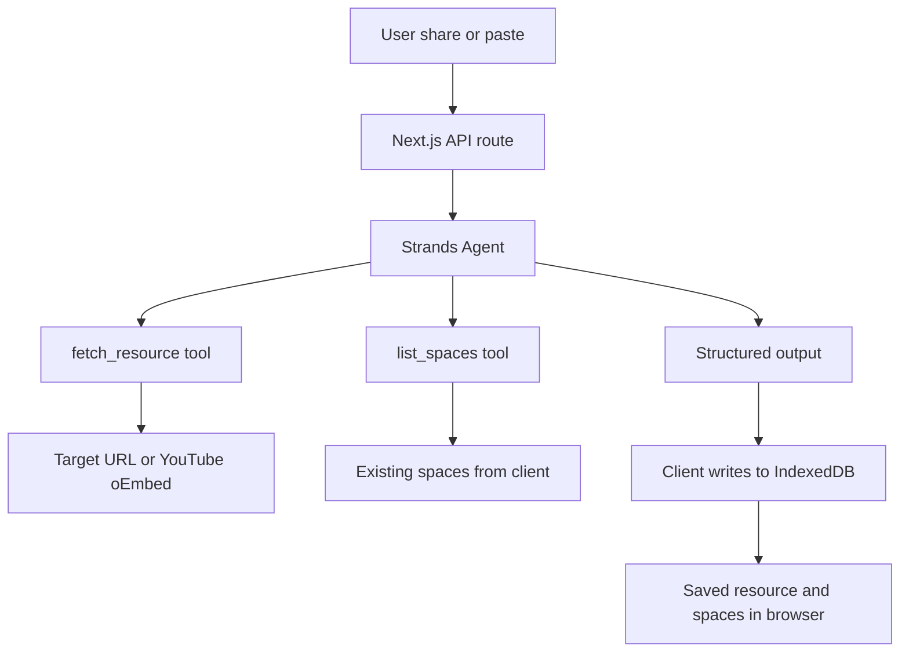

# Revia

Revia is an information capture and resurfacing agent for the "Agents for Humans" hackathon, built with the Strands Agents SDK. It accepts a resource URL, classifies it, stores it in a local personal space, and helps the user reconnect with it later by surfacing relevant context instead of leaving it as an unstructured bookmark list.

## Table of Contents

- [What Revia does](#what-revia-does)
- [The problem it solves](#the-problem-it-solves)
- [How it works](#how-it-works)
- [Architecture](#architecture)
- [Tech stack](#tech-stack)
- [Getting started](#getting-started)
- [Project structure](#project-structure)
- [The Strands agent](#the-strands-agent)
- [Current limitations](#current-limitations)
- [License](#license)

## What Revia does

Revia captures a URL from either the browser share flow or a manual paste flow, fetches the resource, and asks a Strands agent to decide how it fits into the user's existing information system. The agent returns a structured decision with a title, description, resource type, space name, tags, and reasoning.

The client then writes that result into IndexedDB. The idea is to keep the saved item local, with enough metadata to make it easier to find later without adding a separate manual labeling step.

## The problem it solves

Most people save links without a clear reason or a good retrieval path. A bookmark folder or saving list does not tell the user why the item mattered, what category it belongs in, or how it connects to other content they have already saved.

Revia addresses that by turning a share action into a small classification step. Instead of storing a bare link, it stores a short description, a type, a space, and contextual tags that can be used during later search and resurfacing.

## How it works

1. The user shares a link or pastes it into the app.
2. A Next.js API route calls a Strands agent with the URL and the current profile context.
3. The agent uses tools to fetch the resource and inspect existing spaces, then returns structured output that the client writes to IndexedDB.

This is intentionally small and local first. The server is used for the content fetch and model reasoning step, while the browser remains the source of truth for saved user data.

## Architecture



The request flow is simple. A user action enters the app, the server route receives the URL, the Strands agent fetches the resource and inspects the user's current spaces, and the final decision is returned as structured data. The client is responsible for persisting that data locally in IndexedDB.

## Tech stack

- Next.js 16
- TypeScript
- Tailwind v4
- Strands Agents SDK
- Groq via an OpenAI-compatible endpoint
- IndexedDB via the idb package
- PWA support with Web Share Target

This is a local-first browser app with a small server-side inference step. The user data stays in the browser, while the agent uses a remote model to classify and describe the saved resource.

## Getting started

1. Clone the repository:

   ```bash
   git clone <repository-url>
   cd revia
   ```

2. Install dependencies:

   ```bash
   npm install
   ```

3. Create a local environment file:

   ```bash
   echo "GROQ_API_KEY=your-key-here" > .env.local
   ```

4. Start the app:

   ```bash
   npm run dev
   ```

5. Open the app in a browser tab and test the share flow or paste flow.

The app is designed to be run in a real browser, not only inside an embedded preview. That matters for installability and the Web Share Target flow.

## Project structure

```text
src/
  app/
    about/
    api/
      process-resource/
    category/
    home/
    icons/
    onboarding/
    page.tsx
    privacy/
    profile/
    resource/
    save/
    search/
    share/
    terms/
  components/
    category-filter.tsx
    container.tsx
    more-card.tsx
    register-sw.tsx
    resource-card.tsx
    reveal.tsx
    side-menu.tsx
    smart-toast.tsx
    wordmark.tsx
  lib/
    connections.ts
    db.ts
    i18n.ts
    install-context.tsx
    language-context.tsx
    notification-sound.ts
    resource-types.ts
    storage.ts
    types.ts
    use-save-resource.ts
```

The app folder contains route-level screens and the API route that processes shared resources. The components folder holds UI pieces used across the app. The lib folder contains storage, state, language, and resource-type helpers.

## The Strands agent

The server-side agent is intentionally small and explicit. It has two tools:

- fetch_resource: fetches a URL, handles YouTube oEmbed when applicable, and extracts core metadata such as the title, description, site name, and preview image.
- list_spaces: returns the user's existing space names so the agent can keep the organization consistent instead of creating duplicates.

There is no separate save tool. The final answer is the structured output itself, including the title, description, resource type, space, tags, and reasoning. That output is returned to the client and then persisted by the browser code into IndexedDB. This keeps the agent focused on decision making, while local storage remains responsible for durable user state.

## Current limitations

- No account system or cloud sync yet. Data stays in IndexedDB on the device.
- No Bedrock or AgentCore deployment yet.
- iOS Safari does not support Web Share Target, so the manual paste flow is the fallback on that platform.
- The current interface is English only.

## License

This project is licensed under the MIT License. See the root [LICENSE](LICENSE) file for details.
